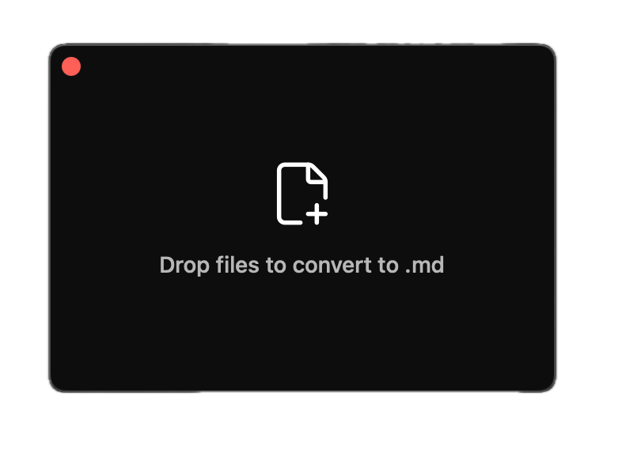

# Drop to MD



A small floating Mac window. Drop one or more files on it and each one is converted to Markdown, saved next to the original (or in Downloads if that folder is read-only).

## Install

1. Download `DropToMD.zip`, unzip it, and move **Drop to MD** into Applications.
2. The app isn't notarized by Apple, so macOS stops the first launch:
   - **macOS 14:** right-click the app, choose **Open**, then **Open** again.
   - **macOS 15 and later:** double-click the app and close the warning. Open **System Settings → Privacy & Security**, scroll down, click **Open Anyway** next to Drop to MD, and confirm.

After that it opens normally. Nothing else to install: Python and markitdown are bundled.

Requires macOS 14 or later on Apple Silicon.

## Formats

PDF, Word, PowerPoint, Excel (xlsx, xls), HTML, EPUB, Jupyter, Outlook msg, ZIP, CSV, JSON, XML, RSS, text, YAML, audio (mp3, wav, m4a), plus Mac formats: Pages, Numbers, Keynote (needs the matching app), RTF, RTFD, DOC, ODT, webarchive, and images (PNG, JPG, HEIC, TIFF, GIF, BMP, WebP) through on-device text recognition.

## Build

```sh
./build.sh
```

Needs Xcode command line tools and [uv](https://github.com/astral-sh/uv). Produces `~/Applications/Drop to MD.app` and `dist/DropToMD.zip`.

## Built on

- [microsoft/markitdown](https://github.com/microsoft/markitdown): the conversion engine for most formats
- [python-build-standalone](https://github.com/astral-sh/python-build-standalone), installed through uv: the relocatable Python bundled in the app
- Apple Vision: on-device text recognition for images
- Apple `textutil`: RTF, DOC, ODT and webarchive to HTML before markitdown
- Pages, Numbers and Keynote: iWork files are exported to Office formats through their own app
- [Lucide](https://lucide.dev): the `file-plus-corner`, `file-check` and `x` icons
- [shift-labs-ai/markit](https://github.com/shift-labs-ai/markit): evaluated as a faster Rust engine; not used, since it covers fewer formats

MIT licensed, see [LICENSE](LICENSE). License notices for bundled and embedded third-party work: [THIRD_PARTY_NOTICES.md](THIRD_PARTY_NOTICES.md).
